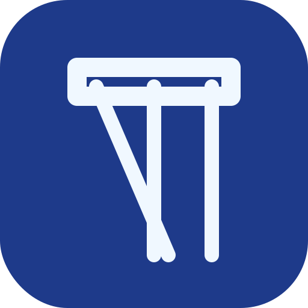

<div align="center">
  
  <h1>🏛️ Archivo Histórico Digital PWA</h1>
  <p><em>Sistema de digitalización y gestión documental ultrarrápido con capacidades offline.</em></p>

  <!-- Badges -->
  <p>
    
    
    
    
  </p>
</div>

---

## 📖 Descripción

El **Archivo Histórico Digital** es una Aplicación Web Progresiva (PWA) diseñada para instituciones que necesitan digitalizar, consultar y archivar documentos históricos de manera eficiente y segura. 

Destaca por su capacidad para manejar miles de registros en memoria mediante la implementación de motores nativos **IndexedDB**, garantizando que el navegador mantenga un rendimiento fluido, permitiendo guardar el progreso automáticamente y buscar registros a velocidades increíbles.

## ✨ Características Principales

- 📦 **Soporte Nativo de Paquetes:** Abre y visualiza paquetes jerárquicos (`.cll`, `.xlb`, `.jor`) directamente en el navegador.
- ⚡ **Rendimiento Extremo:** Gestión de memoria delegada a IndexedDB. No se congela incluso con cargas masivas.
- 🔍 **Buscador General Unificado:** Búsqueda instantánea por nombre, fecha, folio, libro o notas en el catálogo histórico central.
- 📱 **PWA Completa:** Instalable en computadoras de escritorio, tablets y dispositivos móviles.
- 🛠️ **Herramientas de Digitalización:** Incluye scripts nativos automatizados (`empaquetar.bat` y `empaquetar.sh`) que preparan las carpetas de trabajo diario, comprimen libros en `.xlb`, y compilan colecciones enteras en archivos `.cll`.
- 🔒 **Modo Archivista Restringido:** Zona administrativa secreta para creación y edición de metadatos (accesible vía triple-tap y clave).

## 🚀 Empezando

Dado que es una PWA basada en tecnologías frontend estándar (HTML, CSS Vanilla y JS), el despliegue es sumamente sencillo.

### 1. Despliegue
Simplemente levanta el proyecto en cualquier servidor web estático (Apache, Nginx, Live Server, GitHub Pages, Vercel, etc.):

```bash
# Ejemplo usando Python (solo para pruebas en desarrollo local)
python3 -m http.server 8000
```
Visita `http://localhost:8000` en tu navegador.

### 2. Uso para Digitalizadores
El sistema permite trabajar de dos maneras:

1. **Directorio Local:** Puede seleccionar su carpeta de trabajo raíz (ej. `Coleccion/Libro/Dia_Trabajo`). La aplicación detectará sus imágenes y guardará un archivo `metadatos.lib` localmente para no perder su progreso antes de empaquetar. Además, el sistema permite registrar múltiples entradas para una misma imagen.
2. **Empaquetado Automático:** Desde la misma pantalla de inicio puede descargar el script de empaquetado. Este script se coloca en la carpeta de trabajo del día y al ejecutarse:
   - Transforma las extensiones `.jpg` a un formato ofuscado `.pag`.
   - Comprime la carpeta de trabajo del día en un archivo `.jor`.
   - Comprime todos los días de trabajo del libro en un archivo `.xlb`.
   - Comprime todos los libros de la colección en un archivo maestro `.cll`.

### 3. Apertura de Archivos Empaquetados
Una vez generados los paquetes, el usuario final puede abrir directamente un archivo `.cll` o un conjunto de archivos `.xlb` desde la aplicación para consultarlos de forma segura.

## 📁 Jerarquía y Extensiones

La aplicación utiliza un sistema jerárquico de ofuscación y empaquetado para mantener el orden:
- `.cll` **(Colección):** Paquete maestro que agrupa múltiples libros (ej. Sistema de Archivo, Matrimonios).
- `.xlb` **(Libro/Expediente):** Paquete que contiene las jornadas de trabajo de un libro específico.
- `.jor` **(Jornada de Trabajo):** Paquete que agrupa el trabajo de un día o un lote específico.
- `.pag` **(Páginas):** Imágenes ofuscadas dentro de cada jornada.
- `.lib` **(Librería de Metadatos):** Archivo JSON interno que guarda la información registrada.

## 📁 Estructura del Proyecto

```text
├── index.html           # Punto de entrada principal y vistas UI
├── manifest.json        # Manifiesto PWA
├── sw.js                # Service Worker para capacidades offline
├── css/
│   └── styles.css       # Estilos base
├── js/
│   ├── config/          # Configuración de UI (Tailwind tokens)
│   ├── core/            # Núcleo de la app (Base de datos e Interfaz)
│   ├── app/             # Lógica modular: Visor, Archivos, UI
│   └── main.js          # Inicialización
├── icons/               # Iconografía vectorial y logos
└── empaquetar.*         # Scripts de utilería (Shell y Batch)
```

## 🔐 Zona Administrativa (Archivista)
Para acceder a los controles de edición y escritura de paquetes:
1. Haga **tres toques (o clics) rápidos** sobre el ícono superior izquierdo (Templo).
2. Ingrese la clave de administrador para desbloquear los formularios de metadatos, funciones de autocompletado en lote y finalización de digitalizaciones.

## 📄 Licencia

Este proyecto está bajo la Licencia **MIT**. Eres libre de usar, copiar, modificar, fusionar, publicar, distribuir, sublicenciar y/o vender copias de este software.

> Desarrollado y mantenido por [crgm.app](https://crgm.app) | Repositorio Original: [robindanilo2218/digitalizacion](https://github.com/robindanilo2218/digitalizacion)
